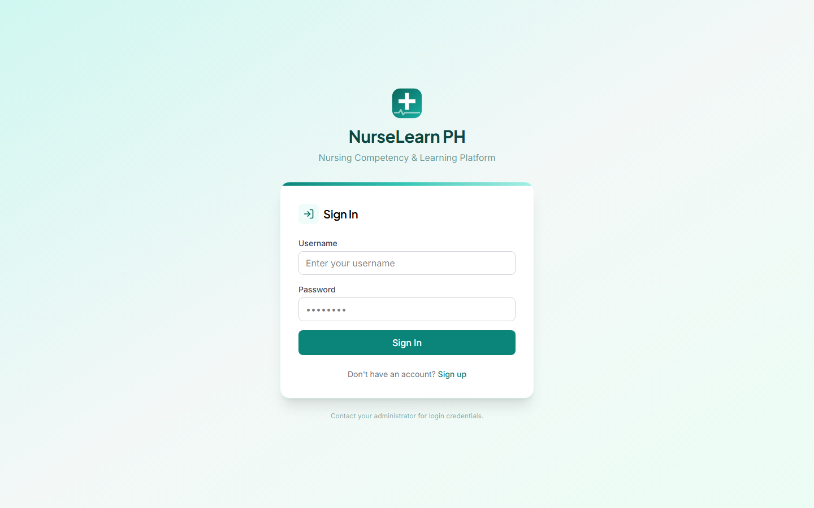

# NurseLearn PH

**Nursing Competency, Clinical Reasoning & Learning Management Platform**

A full-featured learning management system designed for Bachelor of Science in Nursing (BSN) students and nursing educators in the Philippines.

**Live:** https://nurselearn-ph.vercel.app — frontend on Vercel, API on a local PC through a Cloudflare tunnel. Deployment details: [DEPLOY.md](DEPLOY.md) §11.



---

## Features

| Module | Highlights |
|--------|-----------|
| **Academic Management** | Programs, academic years, semesters, year levels, sections, courses, enrollments |
| **Learning Management** | Topics, lessons, learning materials, activities, student progress tracking |
| **Question Bank & Assessments** | Question bank with media, timed assessments, auto-grading, instructor gradebook |
| **Clinical Reasoning (RLE)** | Case-based scenarios, clinical cases with configurable max attempts, case attempts & responses |
| **Nursing Process** | Diagnoses, A→D→P→I→E care plans with Approve/Return/Completed workflow |
| **Skills Laboratory** | Skills, checklists, stations, student skill tracking, assessment requests |
| **Clinical Rotations** | Coordinator/admin-created rotations, selective student assignment, attendance, duty hours |
| **Competency Engine** | Frameworks, competencies, indicators, student competency tracking |
| **Portfolio** | Portfolios, reflections, clinical logs with status workflow |
| **NLE Preparation** | Timed one-question-at-a-time exams, resume support, performance analytics |
| **Virtual Patient Simulation** | Patient scenarios, state transitions, action/debriefing workflows |
| **AI Tutor** | Chat-based tutoring with Socratic questioning, hints, conversation history |
| **AI Content Generation** | Generate questions/cases/study guides, instructor approval workflow, return-for-revision |
| **Research Analytics** | Research projects, pre/post tests, cohorts, participant tracking, data exports |
| **Announcements** | Draft→Publish→Archive workflow, audience targeting (students/instructors), bell notifications, read receipts |
| **User Management** | Admin-only password editing, contact numbers, role-based access (5 roles) |
| **Self-Signup** | Public `/signup` with email verification (Resend > SMTP > dry-run), admin approval queue, `SIGNUP_MODE=approval\|auto\|off` |
| **Dashboard** | Role-specific widgets, unread announcement feed, analytics summaries |
| **Audit Logging** | Full audit trail for all CRUD operations and authentication events |

---

## Quick Start

### Prerequisites

- Node.js v18+
- npm v9+
- PostgreSQL 14+

### Setup

```bash
# 1. Install dependencies
npm install

# 2. Configure environment
cp .env.example .env
# Edit .env with your PostgreSQL credentials and JWT secrets

# 3. Create database
psql -U postgres -c "CREATE DATABASE nurselearn_ph"

# 4. Push schema to database
cd server && npm run db:push

# 5. Seed initial data + demo content
psql -U postgres -d nurselearn_ph -f scripts/load-nle-bank.sql      # full NLE bank (516 questions)
npm run db:seed
psql -U postgres -d nurselearn_ph -f scripts/seed-nanda-diagnoses.sql  # 37 NANDA-I diagnoses

# 6. Start development
cd .. && npm run dev
```

### URLs

| Service | URL |
|---------|-----|
| Frontend | http://localhost:5173 |
| Backend API | http://localhost:3002 |
| API Health | http://localhost:3002/api/health |
| Swagger Docs | http://localhost:3002/api/docs |

### Default Accounts

Accounts are created automatically by the seed script. See `server/src/database/seed.ts` for the full roster.

---

## Architecture

### Tech Stack

| Layer | Technology |
|-------|-----------|
| Frontend | React 19, TypeScript, Vite, Tailwind CSS v4, React Router v7 |
| Backend | Node.js, Express 5, TypeScript |
| Database | PostgreSQL 14+ |
| ORM | Drizzle ORM |
| Validation | Zod |
| Auth | JWT + bcrypt |
| AI | Google Gemini (optional, falls back to mock) |
| Email | Nodemailer / SMTP (optional, dry-runs when unset) |
| Logging | Pino |
| Testing | Vitest, Supertest, Testing Library |

### Project Structure

```
nurselearn-ph/
├── client/                  # React frontend
│   ├── src/
│   │   ├── components/      # Shared UI (DataTable, Sidebar, etc.)
│   │   ├── pages/           # Route pages (25+ pages)
│   │   ├── layouts/         # App shell, Sidebar
│   │   ├── services/        # API client (axios)
│   │   ├── hooks/           # Custom React hooks
│   │   ├── utils/           # Permissions, helpers
│   │   └── routes/          # Route definitions
│   └── dist/                # Production build output
├── server/                  # Express backend
│   ├── src/
│   │   ├── config/          # Env, Swagger config
│   │   ├── database/        # Schema, migrations, seed
│   │   ├── middleware/       # Auth, upload, rate limiting
│   │   ├── modules/         # Feature modules (20+ modules)
│   │   ├── services/        # Email, Gemini, etc.
│   │   └── utils/           # Helpers
│   ├── tests/               # Server test suites (21 files)
│   ├── scripts/             # Build, cleanup, purge scripts
│   └── dist/                # Compiled JS output
├── database/
│   └── migrations/          # Drizzle migration files (0000–0006)
├── scripts/               # Docs screenshot capture (capture-doc-screenshots.mjs)
├── storage/                 # Uploaded files (documents, images, etc.)
├── .env.example             # Environment template
├── DEPLOY.md                # Production deployment guide
├── README.md                # This file
└── smoke-test.ps1           # Live smoke test (frontend + API + auth)
```

### Server Modules

```
server/src/modules/
├── academic/          # Programs, years, semesters, sections, courses, enrollments
├── adaptive/          # Adaptive learning paths
├── admin/             # Admin dashboard, audit logs
├── ai-content/        # AI-generated questions, cases, study guides
├── ai-tutor/          # Chat-based AI tutoring
├── analytics/         # Student & course analytics
├── announcements/     # Announcements, audiences, bell, read receipts
├── assessment/        # Questions, assessments, attempts, grading
├── clinical/          # Clinical cases, attempts, rotations, attendance
├── clinical-rle/      # Clinical RLE scenarios
├── competency/        # Frameworks, competencies, indicators
├── learning/          # Topics, lessons, materials, activities
├── nle/               # NLE exams, question bank, performance
├── notifications/     # Notification system
├── nursing-process/   # Diagnoses, care plans (A→D→P→I→E)
├── portfolio/         # Portfolios, reflections, clinical logs
├── research/          # Research projects, cohorts, participants
├── simulation/        # Virtual patients, scenarios, debriefings
├── skills-lab/        # Skills, checklists, stations, assessments
└── users/             # User management, password reset
```

---

## Testing

```bash
# Server tests (335 tests, 21 files)
cd server && npm test

# Client tests (124 tests, 12 files)
cd client && npm test

# Type checking
cd server && npx tsc --noEmit
cd client && npx tsc --noEmit

# Live smoke test (frontend + API + auth; exits non-zero on failure)
powershell -ExecutionPolicy Bypass -File .\smoke-test.ps1

# Refresh the docs screenshots after UI changes (headless Chrome)
npm run docs:shots
```

> Server suites snapshot the database clock at start and delete the audit rows
> they write during teardown — `audit_logs` does not grow from test runs, and
> rows that existed before a run are never touched.

### Test Coverage

| Suite | Files | Tests |
|-------|-------|-------|
| Server | 21 | 335 |
| Client | 12 | 124 |
| **Total** | **33** | **459** |

---

## Database

### Schema & Migrations

Schema: `server/src/database/schema/index.ts` (102 tables)
Migrations: `database/migrations/` (0000 → 0007)

```bash
cd server

# Push schema directly (development)
npm run db:push

# Generate migration from schema diff
npm run db:generate

# Apply pending migrations (production)
npm run db:migrate

# Open Drizzle Studio (visual DB browser)
npm run db:studio

# Seed demo data (7 users, BSN program, NUR101, exams, virtual patients, 31 research projects)
npm run db:seed

# Full NLE question bank (516 questions) — run before db:seed on a fresh DB
psql -U postgres -d nurselearn_ph -f scripts/load-nle-bank.sql

# 37 NANDA-I nursing diagnoses — run after db:seed
psql -U postgres -d nurselearn_ph -f scripts/seed-nanda-diagnoses.sql
```

### Utility Scripts

```bash
# Clean all testreg users (registration test residue)
psql -d nurselearn_ph -U postgres -f server/scripts/purge-testreg.sql

# Full pre-deploy cleanup (test data, audit logs, sessions)
psql -d nurselearn_ph -U postgres -f server/scripts/cleanup-for-deploy.sql
```

---

## Deployment

See [DEPLOY.md](./DEPLOY.md) for complete production deployment instructions covering:

- Environment configuration
- Database setup (fresh or cleaned)
- Server build & process management (pm2 / systemd)
- Client build & static file serving
- Reverse proxy with HTTPS (nginx)
- Post-deploy verification

---

## Documentation

- [User Manual](./docs/USER_MANUAL.md) — Complete guide for all user roles (students, instructors, coordinators, admins)
- [Deployment Guide](./DEPLOY.md) — Production deployment instructions

---

## License

Proprietary — For educational use.
